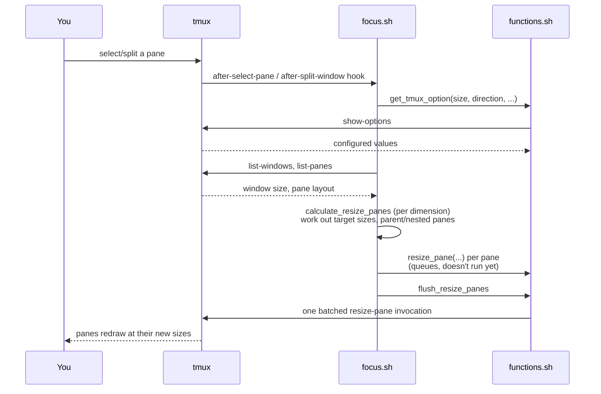

# tmux pane focus

[](https://codecov.io/gh/graemedavidson/tmux-pane-focus)

Tmux plugin to auto resize panes on focus similar to [nvim Focus](https://github.com/beauwilliams/focus.nvim).


Utilises [tmux hooks](./docs/tmux.md#hooks) to react to the creation and selection of panes.

- Size: >=50, <100.
- Direction:
  - `+`: both
  - `|`: width changes only
  - `-`: height changes only

## How it works

`focus.tmux` registers `scripts/focus.sh` against tmux's `after-select-pane` and `after-split-window` hooks, so it
runs on its own every time you switch or create a pane — there's no keybinding to trigger it.



Batching every `resize-pane` into a single `tmux` invocation (rather than one process per pane) means the client
redraws once for the final layout, instead of flashing through each pane's intermediate size.

## Installation

### Tmux Plugin Manager

Add plugin GitHub url to list of tpm plugins. Specify tag/branch for specific version.

```
set -g @plugin 'graemedavidson/tmux-pane-focus'
# set -g @plugin 'graemedavidson/tmux-pane-focus#tag'
```

### Manual

Clone repo into tmux plugins dir.

Add run shell command to end of `.tmux.conf` file to activate plugin.

```conf
run-shell '~/.tmux/plugins/tmux-pane-focus/focus.tmux'
```

## Configuration

Changes to configuration require a tmux config reload or new tmux session to pickup changes. Adding the following
configuration can simply the process for testing which also requires a restart to start using.

```bash
bind R source-file ~/.tmux.conf \; display-message "Config reloaded..."
```

Enable/Disable plugin:

```
set -g @pane-focus-enabled on
```

Add configuration to the `.tmux.conf` file to override the following defaults:

- focus size:       `50%`
- focus direction:  `+`

```conf
set -g @pane-focus-size '50'
set -g @pane-focus-direction '+'
```

### Settings Menu

The default and global settings can be overridden at the window level through an options menu.

tmux shortcut: `ctrl-a T`.

### Status bar

Add current active size and direction to status bar:

```conf
set -g status-right '#[fg=colour255,bg=colour237][#{@pane-focus-direction}][#{@pane-focus-size}]#[fg=default,bg=default]'
```
