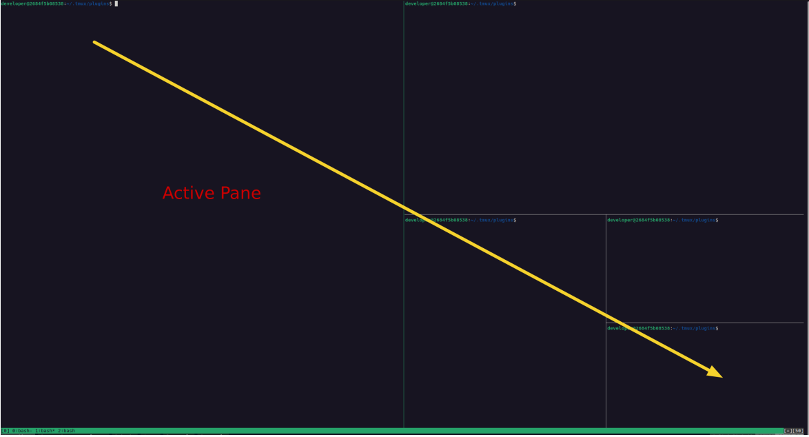
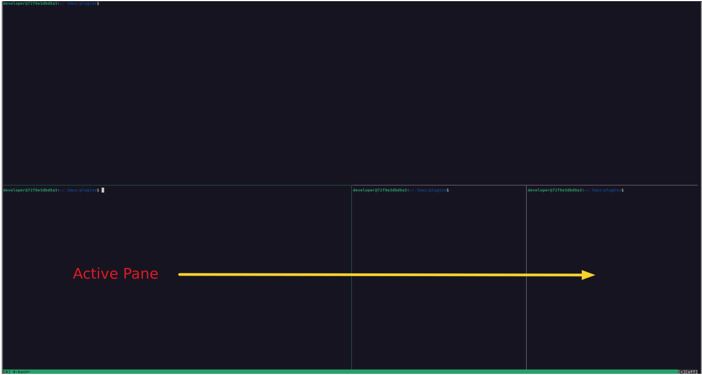
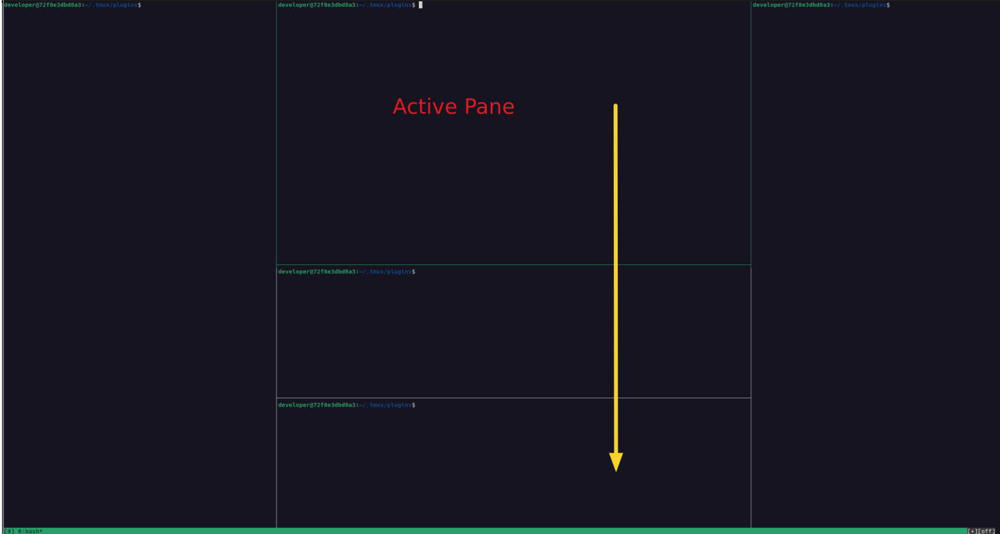
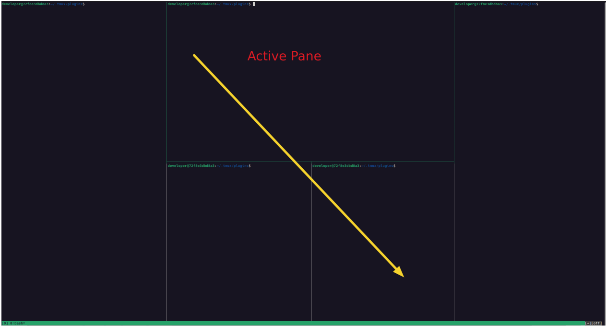
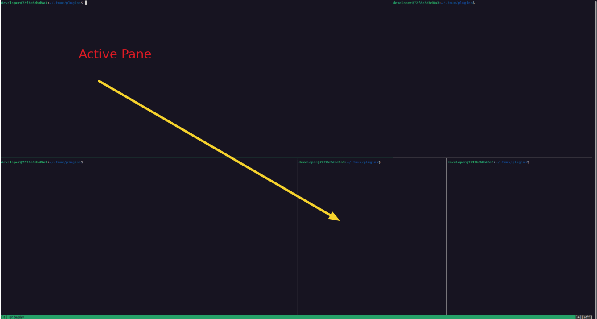
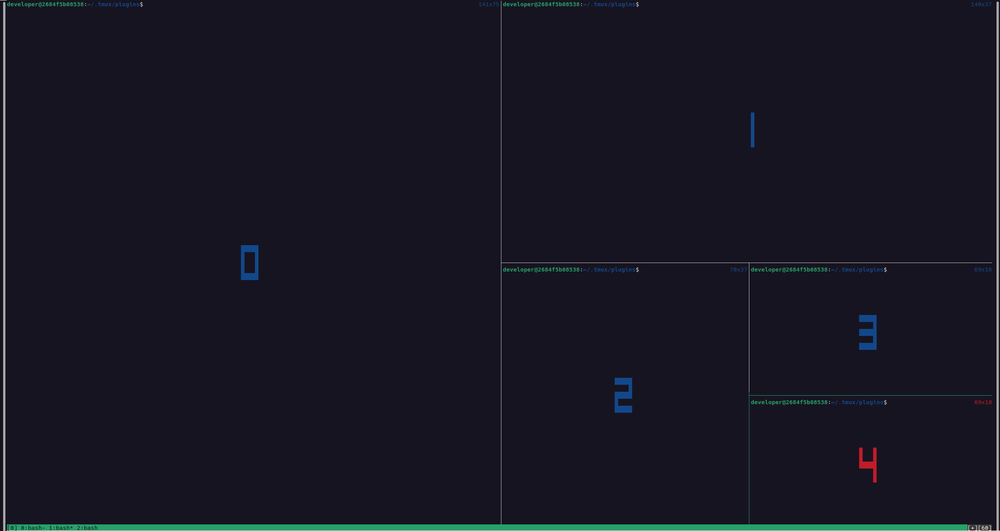

# Architecture

Plugin uses window height and width and the current active percentage size setting to calculate the minimum size of
active pane. If the active pane is lower than the calculated size a list of panes within the row or column of the active
pane calculated and then updated. If the active pane is greater than the calculated minimum no changes occur.

The plugin makes use of the tmux API to modify tmux state. Review tmux man page or [online documentation](http://man.openbsd.org/OpenBSD-current/man1/tmux.1)

## Glossary

- row: horizontal set of panes in which the active pane sits.
- col/column: vertical set of panes in which the active pane sits.
- height: integer value for window or pane.
- width: integer value for window or pane.
- horizontal splits `_`: the number of splits separating panes top to bottom.
- vertical splits `|`: the number of splits separating panes left to right.
- window: A window within a tmux session containing panes
- pane: a individual command prompt within a window
- pane sides: integer value for position within grid (top, bottom, left, and right)
- axis: y representing height and, x representing width

Plugin refers to the x plane as `row` and the y plane as `column` within the code.

## Change Ordering

Currently configured to change size of height then width.

## Pane Limits

Plugin determines the number of panes at start.

if 1 pane, quit.

Currently no upper limit on panes defined, considering changes as resolving complicated layouts with several panes leads
to more erroneous results.

## Active Pane

The plugins main function is to resize the active pane selected by the user to the currently configured active
percentage size. The plugin calculates the remaining screen space divided by number of inactive panes and resizes
accordingly. Design intended to leave inactive panes legible where possible.

## Rows and Columns

Plugin optimised to determine all panes sitting on the x and y planes of the active pane. Therefore all inactive panes
outside of the active pane not resized to reduce plugin operations. Plugin accounts for overlapping panes.

The following examples show each inactive pane found in the column and row of the active pane.

Row Examples:




Column Examples:





## Parent Panes

When tmux resizes a pane any adjacent panes on the column or row is also resized, so for example, a resize command on
pane 1 would change the size of panes 2, 3 and 4 in the below diagrams. The last diagram should return to the same as
the start diagram.

```
# start                      select pane 1 (increase)        select pane 0 (decrease)
 ---------------              ---------------                 ---------------
| 0       | 1   |            | 0  | 1        |               | 0       | 1   |
|         |-----|            |    |----------|               |         |-----|
|         | 2|3 |            |    | 2   | 3  |               |         | 2|3 |
|         |-----|            |    |----------|               |         |-----|
|         | 4   |            |    | 4        |               |         | 4   |
 ---------------              ---------------                 ---------------
```

Plugin determines parent panes by maintaining a stack and pushing when greater value of left or top and pushing when
lower value of left or top. This matches the internal tmux index ordering which moves left to write then top down, so in
the below example pane 3 sits under pane 2, not to the right of it.

```
 ---------------
| 0     | 1     |
|       |-------|
|       | 2 | 4 |
|       |-------|
|       | 3 | 5 |
 ---------------
```

To account for this parent panes have a multiplier value calculated for each child pane and children with same
dimensions aren't added to the resize list. Below examples describe the expectations in greater detail.

Parents determined for rows and columns separately.

### Column example

Changing width when selecting pane 1

```
 ---------------
| 0     | 1     |
|       |-------|
|       | 2 | 3 |
|       |-------|
|       | 4     |
 ---------------
```

- Pane 2, 3, and 4 are children of pane 1.
- Pane 1, 2, and 3 added to list of panes requiring resize.
  - Pane 4 omitted from resize list; same size of parent pane on left and right margins.
  - Pane 1 has multiplier of 2.
- Pane 0 resized to active size
- Pane 1 resized to inactive size * 2
- Pane 2, and 3 resized to inactive size

### Row example

Changing height when selecting pane 1

```
 ---------------
| 0             |
|---------------|
| 1     | 2 | 3 |
|---------------|
| 4     | 5     |
 ---------------
```

- Pane 0, 4, and 5 omitted as not in active pane row.
- Pane 1 not a parent pane as its the active pane.
- Pane 3 child of pane 2.
  - Pane 3 omitted from resize list; same size of parent pane on top and bottom margins
- Pane 1 resized to active size
- Pane 2 resized to inactive size

## Resizing

Plugin makes use of the `tmux resize-pane` command to change a pane.

Targeting of a pane by `-t` parameter when running the resize command. Command accepts an id with the `%` prefix or
an index number. The plugin uses the index value internally for uniquely identifying each pane.

The ordering of changes is from top left to bottom right following the inbuilt [indexing](#indexes) of tmux.

### Indexes

The indexes of current panes shown with command:

```
Ctrl-A q
```

List all panes indexes in order:

```
tmux list-panes -F "#{pane_index}" | sort -n
```



## Language

Plugin language is bash matching the majority of tmux plugins. Bash allows for portability but the language has
limitations. Considerations to moving towards another scripting language for example python in pipeline.

## Global and Local variables

Global variable accessed using the `-g` flag and within the context of this plugin provides access to the configuration
set in the [tmux conf file](#configuration) used as default for all new sessions and windows. Global settings can be
overridden per window with the [settings menu](#setting-menu). The menu uses the `-w` flag to set the option at the
window level.
